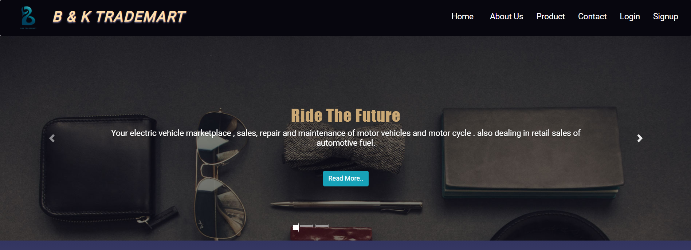
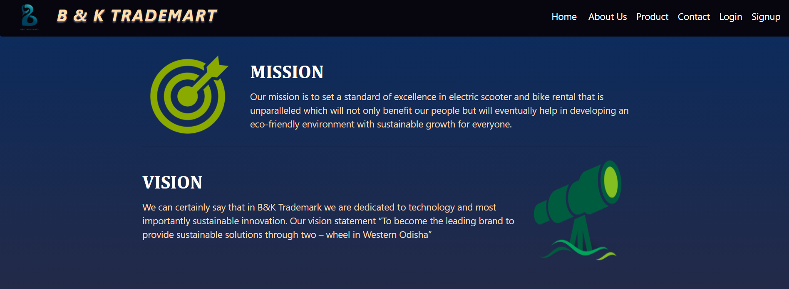
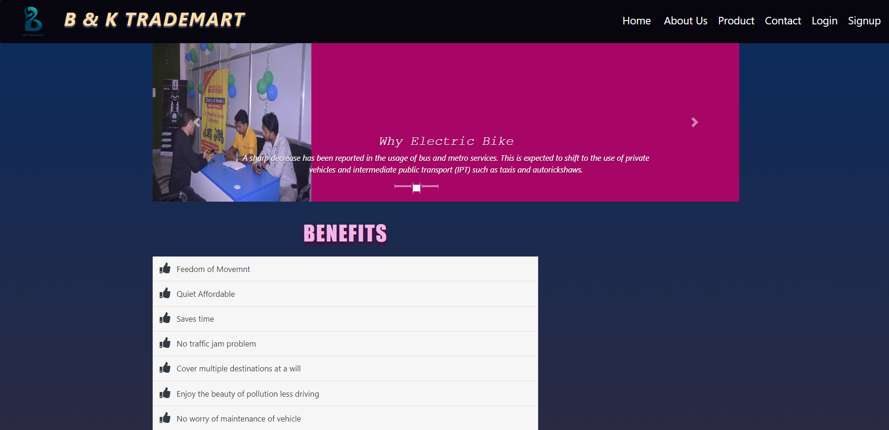
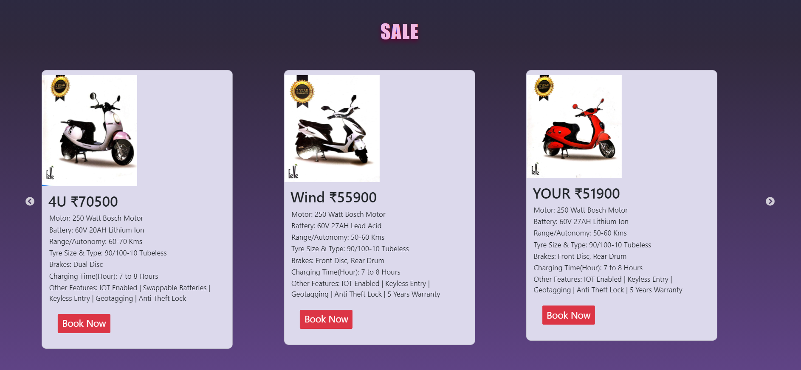
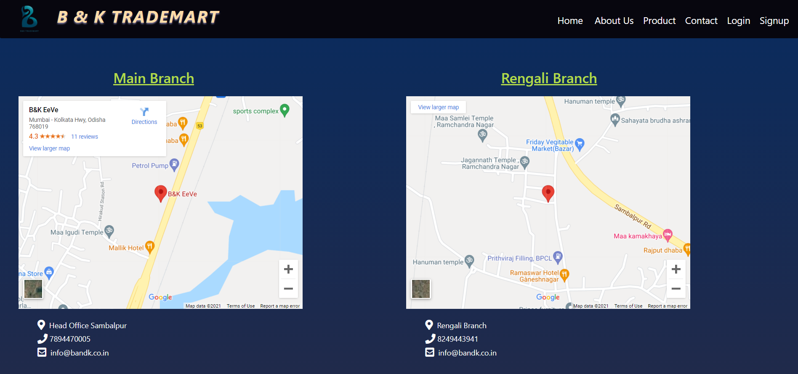
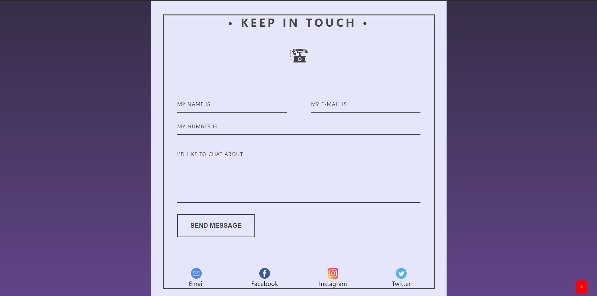
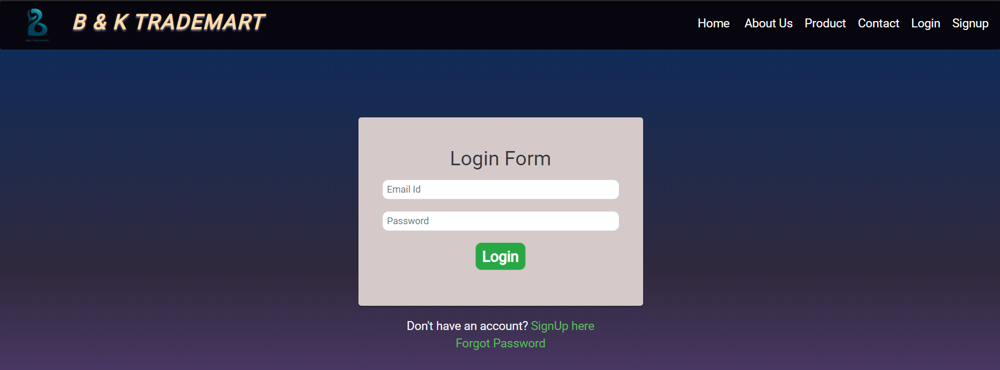
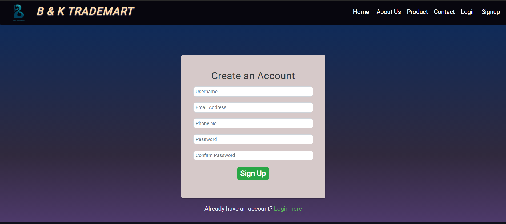

# B-K-Website
Electronics Inventory Web Application.

Steps to run this web app:

Step 1: Open command prompt and navigate to web app's present folder.

Step 2: Type command "node server.js" in order to start the server.

Step 3: Open your web browser and navigate to this link: "http://127.0.0.1:3000"

Home Page:

Feeds:

About:

Officials:

Benefits:

Products:

Locations of showrooms:

Contact:

Login Page:

Signup Page:

